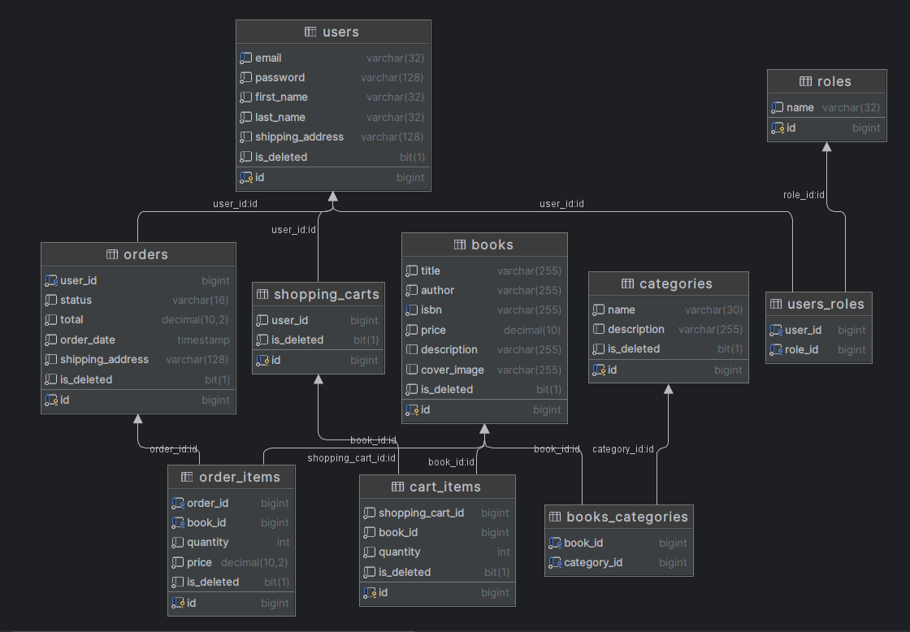

# Welcome to Online Bookstore Project!

---

This project was designed to automate routine tasks in a bookstore. 
All necessary business logic was implemented using the technology stack described below.

In this case, the ability to **view lists of all books**, **view information about the selected book**, 
**add products to the cart and place an order** is implemented. Also, users can manage their shopping
cart according to their needs. \
In addition, functionality for administrators/managers was implemented. That is, a person with appropriate
rights can create new categories, books, and update them. Get information about any user's order and change
their statuses. \
Also, Spring Boot Security was used in the project, which made it possible to implement the possibility 
of registration, login and access to data by roles using a jwt token.

##### You can read more about the project and functionality below.

---

# Project Description

## in this project we used the following technologies:

<details>
  <summary> Java  </summary>

`In this project, we used Java version 17 as the main programming language.`
</details>

<details>
  <summary> Spring Boot</summary>

`A powerful framework for building Java-based applications.`
</details>

<details>
  <summary> Spring Data JPA</summary>

`Simplifies data access and persistence with JPA (Java Persistence API).`
</details>

<details>
  <summary> Spring Security</summary>

`Enables robust and secure authentication and authorization mechanisms.`
</details>

<details>
  <summary> Swager</summary>

`Provides API documentation.`
</details>

<details>
  <summary> MySQL </summary>

` Utilization of a relational database to store information about: `

` * accommodations;  ` \
` * users; ` \
` * addresses; ` \
` * bookings; ` \
` * payments. `

</details>

<details>
  <summary> Docker</summary>

`Used for containerization of the application and database.`
</details>

<details>
  <summary> Lombok</summary>

`Reduces boilerplate code with annotations.`
</details>

<details>
  <summary> Mapstruct</summary>

`Simplifies object mapping between DTOs and entities.`
</details>

<details>
  <summary> Liquibase </summary>

`Ensures the application database is updated along with the application code.`
</details> 

## Database Architecture




## Endpoints

### Endpoints for Registration and Authentication for Users

| Method | Endpoint               | Description                                           | Role   |
|--------|------------------------|-------------------------------------------------------|--------|
| POST   | /api/auth/register     | Register new user by providing required details       | Anyone |
| POST   | /api/auth/login        | Authenticate user by email and password, returning JWT token if valid credentials | Anyone |

### Endpoints for Managing Shopping Cart

| Method | Endpoint                            | Description                                                        | Role       |
|--------|-------------------------------------|--------------------------------------------------------------------|------------|
| GET    | /api/cart                           | Retrieve user's shopping cart                                      | USER       |
| POST   | /api/cart                           | Add a book to the shopping cart                                    | USER       |
| PUT    | /api/cart/cart-items/{id}           | Update quantity of a book in the shopping cart                     | USER       |
| DELETE | /api/cart/cart-items/{id}           | Remove a book from the shopping cart                               | USER       |

### Endpoints for Managing Orders

| Method | Endpoint                            | Description                                                        | Role       |
|--------|-------------------------------------|--------------------------------------------------------------------|------------|
| GET    | /api/orders                         | Retrieve all orders for the current user                           | USER       |
| POST   | /api/orders                         | Place an order from the user's shopping cart                        | USER       |
| PATCH  | /api/orders/{id}                    | Change the status of an order by specifying its id                 | ADMIN      |
| GET    | /api/orders/{id}/items              | Retrieve an order by specifying its id                             | USER       |
| GET    | /api/orders/{orderId}/items/{id}    | Retrieve an order item by specifying its id                        | USER       |

### Endpoints for Managing Categories

| Method | Endpoint                            | Description                                                        | Role       |
|--------|-------------------------------------|--------------------------------------------------------------------|------------|
| GET    | /api/categories                     | Get a list of available categories                                 | USER       |
| POST   | /api/categories                     | Create a new category                                              | ADMIN      |
| GET    | /api/categories/{id}                | Get a category by ID                                               | USER       |
| PUT    | /api/categories/{id}                | Update a category by ID                                            | ADMIN      |
| DELETE | /api/categories/{id}                | Delete a category by ID                                            | ADMIN      |
| GET    | /api/categories/{id}/books          | Receive a list of books by category id                             | USER       |

### Endpoints for Managing Books

| Method | Endpoint                            | Description                                                        | Role       |
|--------|-------------------------------------|--------------------------------------------------------------------|------------|
| GET    | /api/books                          | Get a list of available books                                      | USER       |
| GET    | /api/books/{id}                     | Get a book by ID                                                   | USER       |
| POST   | /api/books                          | Create a new book                                                  | ADMIN      |
| DELETE | /api/books/{id}                     | Delete a book by ID                                                | ADMIN      |
| PUT    | /api/books/{id}                     | Update a book by ID                                                | ADMIN      |

---

## Description of roles

### In this project, users can be unauthenticated, and authorized with the following roles: **USER** and **ADMIN**

#### Unauthenticated:
Unauthenticated users can _register_ in the database using the register endpoint,
and authenticate using _login_.

#### USER:
`The USER role has the following capabilities:`

* Get a list of all categories;
* Get a description of the category by its Id;
* Get a list of all books by the selected category;
* Get a list of all books;
* Get information about the selected book by id;
* Get information about the status and contents of the shopping cart at the moment;
* Add the selected book with the selected quantity to the shopping cart (if such quantity is available, otherwise - the user will be warned);
* Update the number of the selected book;
* Remove the item from the cart completely;
* Create an order based on the shopping cart;
* Get a list of all orders with a description. The list will include all orders of the current user only;
* Get information about your own order by specific id;
* Get an item by a specific id from an order with a specific id.

#### ADMIN
`The "ADMIN" role includes all functions available to the user, 
and additionally, has the following advanced capabilities:`

* Create new categories and their description;
* Update information about the selected category;
* Delete the entire category by id;
* Create a new book, assign it to certain categories;
* Update information about the book (including the amount in stock);
* Delete a book by id;
* Change the status of a specific order (_NEW, CANCELED, PREPARING, PENDING, ON_THE_WAY, DELIVERED, COMPLETED_).

---

## Quick Start

1. **Install Docker:**
   [Install Docker](https://docs.docker.com/get-docker/)

2. **Clone this repository:**
   ```bash
   git clone "repo link"
   cd online-book-store

3. **Create a .env file in the root of the project.
   Use .env.sample as a reference.
   Add necessary environment variables.**
4. **Build the application:**
   ```bash
   mvn clean package
5. **Build and start the Docker containers:**
   ```bash
   docker-compose build && docker-compose up

6. **Test with Swagger:
   Open http://localhost:8080/swagger-ui/index.html in your browser.**

---

######   The application should be running locally at http://localhost:8080.

---


## For additional information or inquiries, please contact:
- [salnikov.markiyan@gmail.com](mailto:salnikov.markiyan@gmail.com)
- [Telegram](https://t.me/resp1dK)
- [LinkedIn](https://www.linkedin.com/in/markiyan-salnikov/)